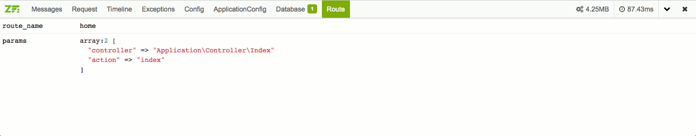

ZfSnapPhpDebugBar [](https://travis-ci.org/snapshotpl/ZfSnapPhpDebugBar)
=================

PHP Debug Bar module for Zend Framework 2

Created by Witold Wasiczko



Features
--------

* All [PHP Debug Bar](http://phpdebugbar.com/) features + additional info about ZF2 application:
  * Log and debug directly to Debug Bar,
  * Check request variables ($_POST, $_GET, $_SERVER, $_COOKIE),
  * Use timeline to see time between common events,
  * Catch exceptions,
  * Preview config and application config,
  * Profile SQL queries,
  * Details about current route,
  * Memory usage,
  * Total request duration,
  * Custom debug bar view,
  * and [more](http://phpdebugbar.com/)...!
* Ready to use - just install via `composer`!
* easy configurable via module config,

Installation
------------

The preferred way to install this extension is through [composer](http://getcomposer.org/download/).

Either run

```bash
php composer.phar require --dev snapshotpl/zf-snap-php-debug-bar "dev-master"
```

or add to your `composer.json` file:

```json
{
    "require-dev": {
        "snapshotpl/zf-snap-php-debug-bar": "dev-master"
    }
}
```

Usage
-----

Add module `ZfSnapPhpDebugBar` to ZF2 `application.config.php`.

```php
return array(
    'modules' => (
        'ZfSnapPhpDebugBar',
    ),
);
```

How to use `Message` tab
------------------------

By function:

```php
debugbar_log('ZfSnapPhpDebugBar is awesome!');
```

By static method:

```php
\ZfSnapPhpDebugBar\Module::log('ZfSnapPhpDebugBar is awesome!');
```

By `Zend\Log`:

```php
$writer = $sm->get('ZfSnapPhpDebugBar\Log\Writer\PhpDebugBar');
$log = new \Zend\Log\Logger();
$log->addWriter($writer);
$log->info('ZfSnapPhpDebugBar is awesome!');
```

Directly by DebugBar object from ServiceManager:
```php
$debugbar = $sm->get('debugbar');
$debugbar['messages']->addMessage('ZfSnapPhpDebugBar is awesome!'));
```

How to config
-------------
Look at `config/zfsnapphpdebugbar.config.php` file
